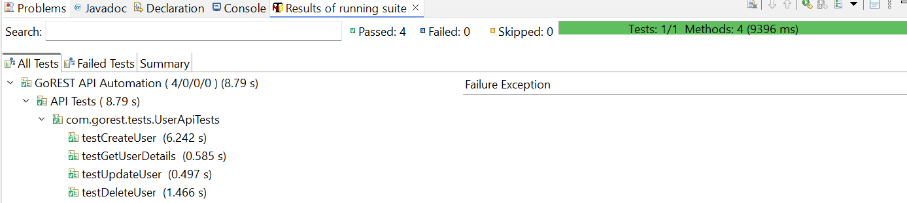

# GoRest API Testing Project

This project demonstrates automated testing of the GoRest API using **Java**, **TestNG**, **Maven**, **Rest Assured**, and **JSON**. The project allows you to perform **CRUD** (Create, Read, Update, Delete) operations for users in the GoRest API.

## Table of Contents
- [Project Overview](#project-overview)
- [Prerequisites](#prerequisites)
- [Installation](#installation)
- [Project Structure](#project-structure)
- [Running Tests](#running-tests)
- [TestNG XML Configuration](#testng-xml-configuration)
- [Generating Reports](#generating-reports)
- [Screenshots](#screenshots)
- [Resources](#resources)

## Project Overview

This project tests the [GoRest API](https://gorest.co.in/) using automated API tests written in **Java** with **TestNG** and **Rest Assured**. The tests include basic CRUD operations on user data, including:

- Create a new user
- Read user details
- Update user information
- Delete a user

By integrating **Maven** and **TestNG**, we enable easy test management, execution, and reporting.

## Prerequisites

Before setting up this project, ensure you have the following installed:

- **Java Development Kit (JDK)**: [Download JDK](https://www.oracle.com/java/technologies/javase-jdk11-downloads.html)
- **Apache Maven**: [Download Maven](https://maven.apache.org/download.cgi)
- **An IDE** (e.g., Eclipse or IntelliJ): [Eclipse IDE](https://www.eclipse.org/downloads/)
- **GoRest API Token**: Sign up for a GoRest account and generate your token at [GoRest](https://gorest.co.in/).

## Installation

### Step 1: Clone the Repository

Clone this repository to your local machine:

```bash
git clone https://github.com/yourusername/gorest-api-tests.git
```
### Step 2: Import the Project into Your IDE

- Open Eclipse (or your preferred IDE).
- Select **File** > **Import** > **Maven** > **Existing Maven Projects**.
- Browse to the folder where you cloned the project and click Finish.

### Step 3: Add GoRest API Token

- Open `ApiService.java`.
- Replace the placeholder `YOUR_ACCESS_TOKEN` with your actual GoRest API token:

`Java private static final String ACCESS_TOKEN = "bf8abffe762cf663f8c8d61ef5285ac738d2f7c3d73625f03d048340a18c2249"; `

## Project Structure

```bash
gorest-api-tests/
│
├── pom.xml                      # Project dependencies and build configuration
├── src/
│   └── test/
│       ├── java/
│       │   ├── com/
│       │   │   └── gorest/
│       │   │       ├── api/    # Contains ApiService.java
│       │   │       ├── tests/   # Contains TestNG test cases like UserApiTests.java
│       │   │       └── utils/   # Utility classes like RandomGenerator.java
│       └── resources/
│           └── testng.xml       # TestNG suite configuration
└── README.md                    # Project instructions and documentation
```
## Running Tests

### Step 1: Run Tests Using Maven

- You can run the tests using Maven with the following command:

```bash
Copy code
mvn clean test
```

This will automatically run the **testng.xml** suite, which executes all **TestNG** tests in the **src/test/java/com/gorest/tests** folder.

### Step 2: Run Tests Using TestNG in Eclipse

- Right-click on the **testng.xml** file in **src/test/resources**.
- Select **Run As > TestNG Suite**.
- **TestNG** will execute all tests defined in the **testng.xml** file.

## TestNG XML Configuration

- The **testng.xml** file defines the test suite and the classes to run:

```xml
<?xml version="1.0" encoding="UTF-8"?>
<!DOCTYPE suite SYSTEM "https://testng.org/testng-1.0.dtd">
<suite name="GoRest API Test Suite">
    <test name="GoRest API Test">
        <classes>
            <!-- List of test classes to execute -->
            <class name="com.gorest.tests.UserApiTests"/>
        </classes>
    </test>
</suite> 
```
You can modify this file to include other test classes or groups if needed.

## Generating Reports

After running the tests, **TestNG** automatically generates a report. You can find the TestNG HTML report in the **target/surefire-reports/** folder.

### Steps to View the Report:

- Navigate to the **target/surefire-reports/** folder in your project directory.
- Open **index.html** in a web browser to see the detailed report of the test run.

## Screenshots

### Here are a few screenshots of the project setup and test results:

### Project Structure

Below is the project structure in Eclipse:


## TestNG Test Results

Here are the test results from the TestNG run:



## Resources

### Here are some additional resources to help you understand and extend the project:

- [GoRest API Documentation](https://gorest.co.in/docs)
- [TestNG Documentation](https://testng.org/doc/documentation-main.html)
- [Rest Assured Documentation](https://rest-assured.io/)
- [Maven Surefire Plugin](https://maven.apache.org/plugins/maven-surefire-plugin/)
- [How to Use Maven with Eclipse](https://www.eclipse.org/m2e/documentation/m2e-user-guide/index.html)


